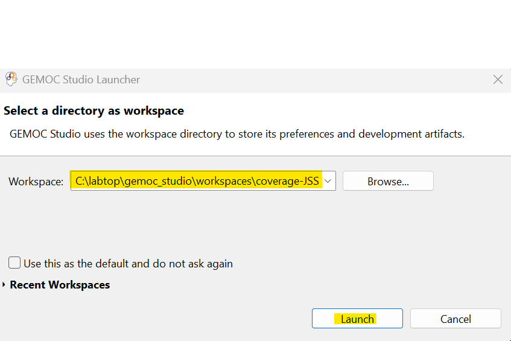
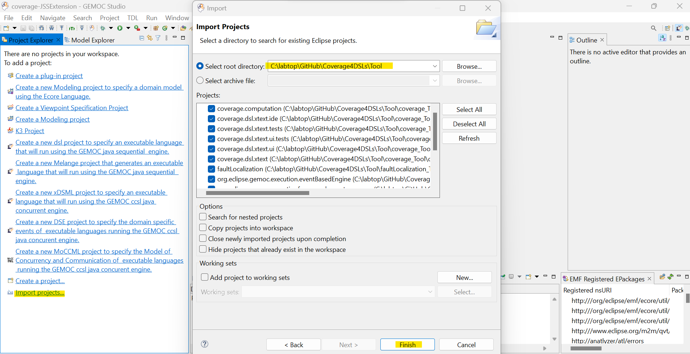
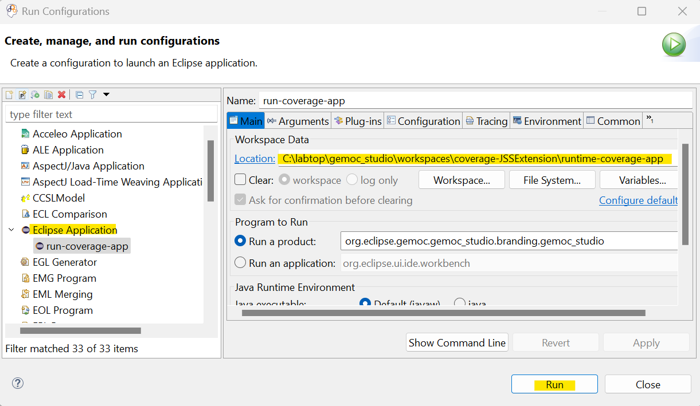

# From Coverage Computation to Fault Localization for Executable DSLs
This repository contains the tool and the evaluation data of our paper titled "From Coverage Computation to Fault Localization: A Generic Framework for Domain-Specific Languages", submitted to SLE 2022.

## Content Overview
1.	*Tool*: a set of eclipse plugins
- **coverage_Tool**: the coverage computation tool (`coverage.computation` plugin) and the textual syntax of the DSL-Specific Coverage metalanguage.
- **faultLocalization_Tool**: the fault localization tool (`faultLocalization` plugin)
- **testing_tool**: the plugins of the testing framework of Khorram et al. [[1]](https://faezeh-kh.github.io/publication/sosym22/) that we used for the definition and execution of the test cases on executable models.
2.	*xDSLs*: the implementation of four Executable Domain-Specific Languages (xDSLs) of our case study, including:
    
    2.1. **xFSM** (taken from [GEMOC official samples](https://github.com/eclipse/gemoc-studio/tree/master/official_samples/K3FSM))

    2.2. **xArduino** (inspired from [Arduino Designer Project](https://github.com/mbats/arduino))

    2.3. **xPSSM** (taken from [examples of behavioral interface project](https://github.com/tetrabox/examples-behavioral-interface/tree/master/languages/statemachines))

    2.4. **xMiniJava** (inspired from [MiniJava project](https://www.cambridge.org/resources/052182060X) and taken from [MiniJava implementation in GEMOC](https://github.com/gemoc/minijava)). 
    
    The implementation of xDSLs involves several projects:

- <u>Abstract Syntax</u>: containing the `Ecore` metamodel of the xDSL and the java code generated from it using the `.genmodel` file
- <u>Operational Semantics</u>: containing the interpreter of the xDSL implemented in `Xtend`
- <u>Behavioral Interface</u>: containing a `.bi` file that is the interface of the xDSL and a java class that do the setups, so GEMOC engines can find and use the interface (Please note that only *xArduino* and *xPSSM* have such an interface)
- <u>Coverage Rules</u>: definition of a set of DSL-Specific coverage rules in a `.cov` file (Please note that the *xFSM* does not have any coverage rule)
- <u>Executable DSL</u>: containing a `.dsl` file that specifies the name of the xdsl, the path to the `.ecore` file, the list of execution rules of the operational semantics, the id of the behavioral interface project, and the path to the coverage rules.
- <u>Mutation Operators</u>: containing a `.mutator` file which includes the mutation operators defined for the xDSL using [WODEL language](https://gomezabajo.github.io/Wodel/)

    **NOTE**: Currently, we do not provide any graphical syntax for the xDSLs.

3.	*xModels&Tests*: the executable models conforming to each xDSL, a set of mutants generated for each of them (by applying the provided mutation operators using WODEL mutant generator), and a test project containing a test suite along with its execution result and its coverage report (under `result_coverage` folder).

1. *Data4CodeCover*: the equivalent java implementation of the xMiniJava models (taken from [here](https://www.cambridge.org/resources/052182060X/#programs)), and the JUnit tests corresponding to the xMiniJava tests. This data is used to compute the statement coverage of the JUnit tests with [CodeCover](http://codecover.org/index.html) tool.
   
2. An Excel file containing detailed data of the paper’s evaluation

## Setup
**Requirements**: 
- Operating System: Windows 10
- Java 16
- GEMOC Studio Version 3.5.0: https://gemoc.org/download.html
- TDL: https://tdl.etsi.org/eclipse/latest/

After downloading GEMOC Studio, unzip the folder and run it:
1.	Run `GemocStudio` application

    

        
    

    If it shows an error related to the incompatible java versions, you need to edit the `.ini` file (the `GemocSudio configuration settings` file as shown in the above picture under the `GemocStudio application`) and add the path of your installed java using `-vm` key right before the `-vmargs` key. For example,
    
        -vm
        C:/Program Files/Java/jdk-16.0.2/bin/javaw.exe
        -vmargs
        ...

2.	It asks for a workspace, either select an existing workspace or a new folder, then select `Launch`

    

3.	You need to install TDL using the provided update site. To do this, go to the `Help` menu and select `Install new Software`. Add the TDL update site and click on `Next`. Accept the license and follow the steps. At the end, it asks to restart the workspace.

    

        
    

    
    You may receive an error as "Cannot perform the operation" for two plugins: `converters to/from TDL` and `TDL graphical editor`. In this case, Eclipse will suggest skipping their installation and installing everything else. You can continue with this option as these two plugins are not necessary for our tool.

4.	An empty workspace will be shown. Import the projects from the "Tool" directory using `Import projects` option shown in the Project Explorer or by following: File -> Import -> Existing Projects into Workspace -> Select Root Directory (browse to the *Tool* directory) -> Select Folder -> Finish

    

  
**NOTE**: In our case study, we experimented our tool on four xDSLs. In this document, we will show how to run the experiment for xArduino as it was also the running example of the paper. Nevertheless, you can follow the same steps for the other xDSLs.

## Usage
1.	Import the xArduino implementation from the `xDSLs/xArduino` directory in the same way described in the previous step. At the end, your project explorer should be as following picture:

    

1. To deploy the tool and the xArduino DSL, we should run this workspace using `Eclipse Application` run configuration. To do this, follow: Run -> Run Configurations, then choose `Eclipse Application` from the list of available configurations and double click to create an instance of it. You can optionally change the default name and the `workspace data location` of this configuration instance. Finally, press `Run` to open a new Eclipse instance.

    

        
    

    **Note**: The `workspace data location` defines the path to the workspace of the newly opened Eclipse instance.  

2. In the new Eclipse instance, import those projects from the `xmodels&tests` directory that you would like to try the tool for them. Here, we imported the projects related to the running example of the paper from the `XArduino-data` directory as follows:
- `Arduino.RunningExample` project containing:

    a) `runningExample.model`: a sample Arduino model
    
    

        
    

    **NOTE**: Please note that `runningExample.model` is an XMI file and there is no graphical model in the `Arduino.RunningExample` project such as the one shown in the above figure. We use the above figure just to make it more understandable for this tutorial. 
    To open the model using Tree editor, right click on the `runningExample.model` file, Open with -> Other -> Sample Reflective Ecore Model Editor -> OK

    b) `mutants/cic.output0.model`: a mutant generated for the Arduino model
    
    

        
    

- `Arduino.RunningExample_Test` project containing:

    a)	`testSuite.tdlan2`: a test suite for the model that indeed has one test case briefly drawn in the following Figure and completely shown in the next tool screenshot using TDL textual syntax 
    
    

        
    

    b)	`testSuite_mutationReport.txt`: the result of performing mutation analysis on the provided test suite
    
    c)	`testSuite_amplified.tdlan2`: the amplified test suite generated by the tool which contains two test cases, the given test case (a) and one generated test case that improves the mutation score of the given test suite
    
    

        
    

    d) `testSuite_amplificationReport.txt`: the test amplification result 
    

        
    

    **NOTE**: The three files explained in (b), (c), and (d) are indeed the output of our amplification tool. We provided them here to be used during the evaluation of the tool, to check if the tool provides what is expected. In the following, we remove them and show how to run the tool.

4. Run the test amplification tool by right click on the input test suite, here `testSuite.tdlan2` file, and selecting `Amplify TDL Test Suite`

        

5.	When the execution finishes, a message as *“Test Amplification has been performed successfully”* must be shown in the console with a couple of information about the execution result. If the tool were able to generate any new test case, the last message you should see in the console must be *“Phase (4): Saving new test cases”*. By refreshing the test suite project (i.e., right-click on the `Arduino.RunningExample_Test` project and select `Refresh`), the files described above must appear under the project.

    

**NOTE**: We just figured out that there is a small issue in the latest version of TDL textual syntax which causes some syntactical errors in the generated amplified test suites (all the errors can be resolved by surrounding the related fields with quotation marks). We reported this issue to the TDL developers ([link to the reported issue](https://labs.etsi.org/rep/top/ide/-/issues/17)). For now, the tool saves the amplified test suite as an XMI file too which has no error.

    

## Acknowledgment
This project is funded by the [EU H2020 research project Lowcomote](https://www.lowcomote.eu/).
