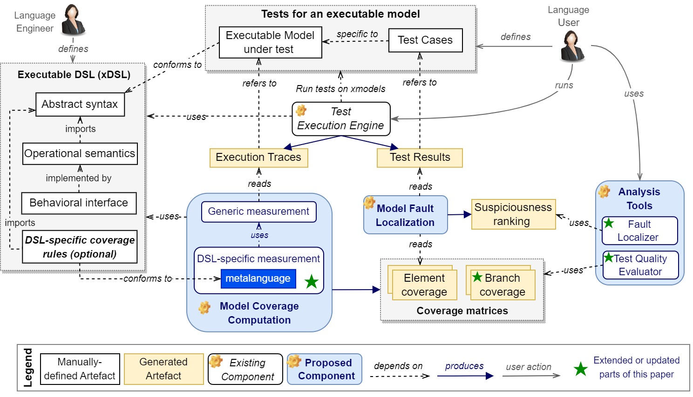
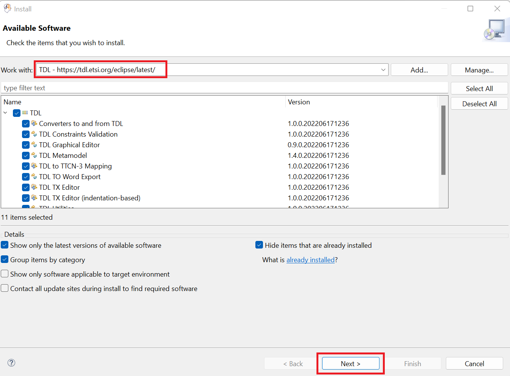
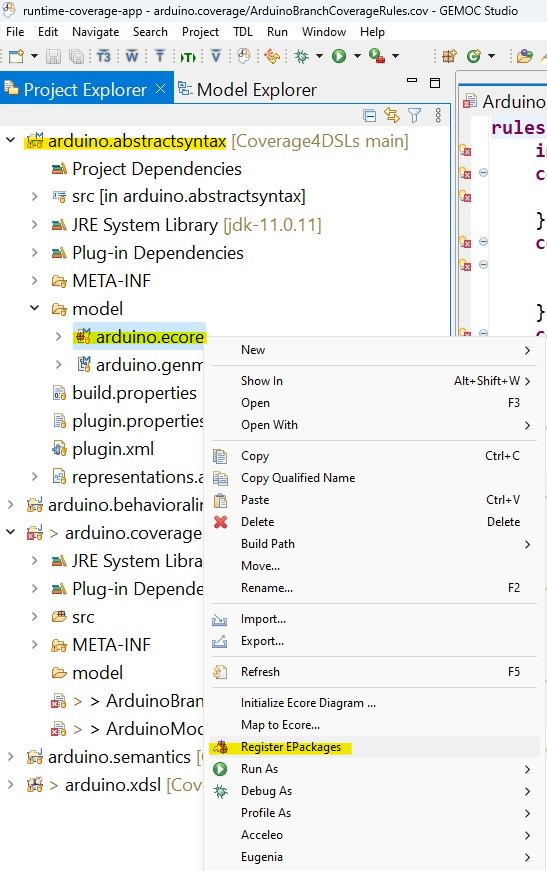
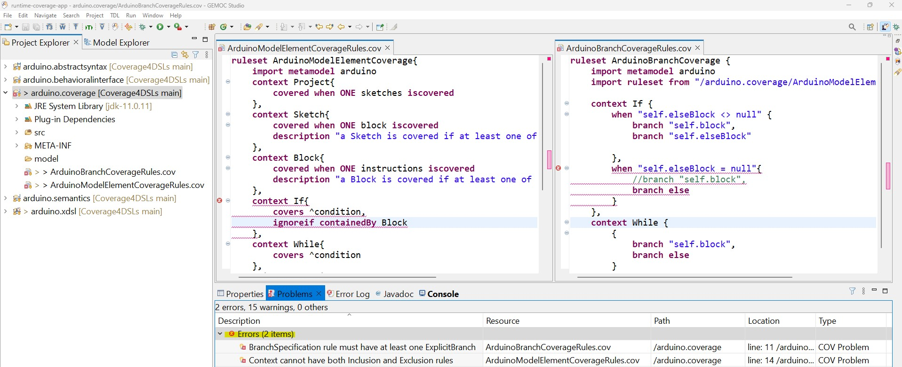
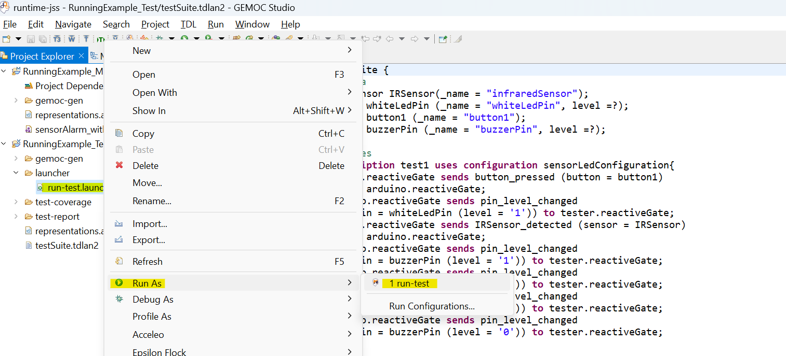
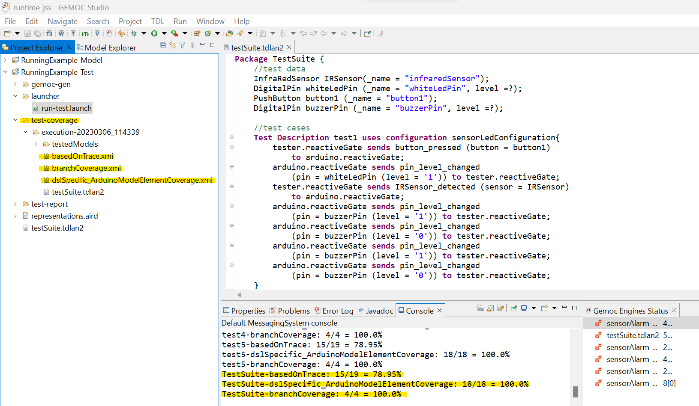
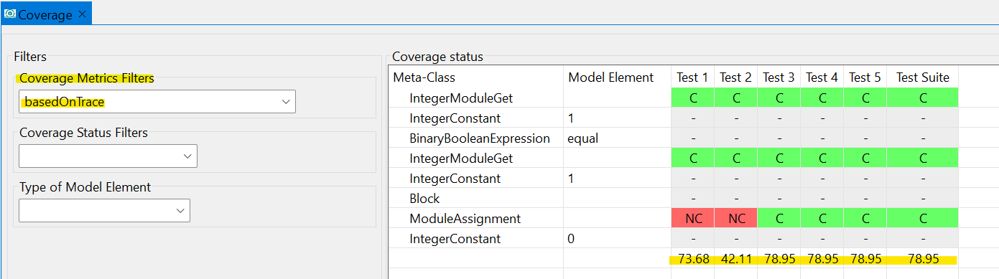
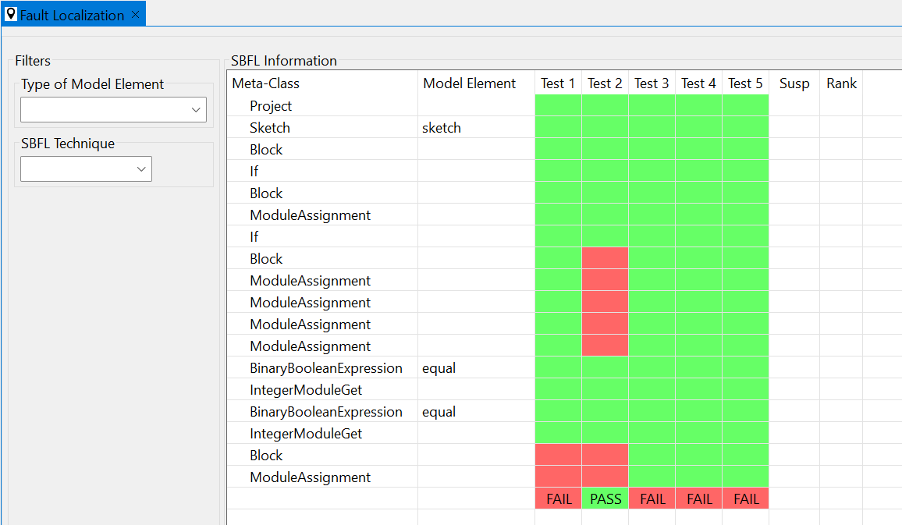

# Coverage for DSLs
This repository contains the tool and the evaluation data of our paper titled "A Language-Parametric Test Coverage Framework for Domain-Specific Languages", submitted to Journal of Systems and Software (JSS).

## Introduction
The following Figure displays an overview of our proposed framework.
Two actors are involved: a language engineer (at the top left corner) who defines an xDSL, and a domain expert (at the top right corner) who defines models (using the xDSL) and test cases for them.
We assume there is an existing testing framework (at the center) that (1) provides facilities for writing and executing test cases for models; and (2) produces the results of the test cases along with the resulting execution trace for the tested model (such as [our previous work](https://github.com/lowcomote/Testing4DSLs)).

    

Then, test coverage is computed in two phases realized by the *Model Coverage Computation* component of the framework (at the bottom left):
The first phase, called *Generic measurement*, computes test coverage based on the *model element coverage* criterion.
It is an off-the-shelf approach that only requires two existing sources of information.
First, from the definition of the given xDSL, it recognizes which classes of the abstract syntax are used by each execution rule of the operational semantics.
This is required to recognize what are the `traceable` elements of the model, i.e., elements whose execution will be captured in the trace.
Second, it analyzes the execution trace of the tested model to extract the model elements that are captured in the trace, meaning that they are `covered` by the test case.
Accordingly, the `traceable` elements that are not captured in the trace are indeed `not-covered` by the test case.
The final output is an *element coverage matrix* containing a list of model elements along with their coverage status.

The second phase, called *DSL-specific measurement,* allows the language engineers to define DSL-specific coverage rules for their xDSLs using a dedicated *metalanguage* (at the bottom left corner).
Two main types of rules can be defined for a given xDSL: customization rules to achieve an intended *model element coverage* measurement, and specification rules to adapt *branch coverage* metric for the xDSL.
The proposed approach applies the coverage rules on the generic coverage measurements and produces one coverage matrix per coverage ruleset.
 
Lastly, we showcase possibilities offered by coverage measurements in two ways:  
(i) test quality evaluation by calculating the coverage percentage for each constructed coverage matrix and visualizing the results for the user (on the bottom right corner); and 
(ii) model fault localization (in the center) based on SBFL techniques by calculating the suspiciousness-based ranking of the model's elements using the test results produced by the test execution engine and the element coverage matrix constructed by our *Model Coverage Computation* component.
Such ranking helps in debugging the model as it directly positions the location of the faults.

This work is an extended and thoroughly improved version of our previous work on the matter ([link to the paper](https://doi.org/10.1145/3567512.3567532), [link to the tool](https://doi.org/10.5281/zenodo.7260980)).
New contents include conditional coverage rules, the validation of coverage rules, the branch coverage metric, an extended evaluation and extended explanations.

This repository contains our provided tool built atop the Eclipse GEMOC Studio.
We also conducted an empirical evaluation of our approach for four different xDSLs to assess its applicability. 
In total, we wrote 301 test cases for 21 executable models with sizes ranging from 7 to 571 elements.
We injected faults into these executable models using [WODEL model mutation tool](https://gomezabajo.github.io/Wodel/) and we executed our approach for 1252 mutants of the executable models.
We observed that (i) meaningful coverage matrices for both *model element coverage* and *branch coverage* metrics can be automatically constructed for the test suites of all examined models; and (ii) the model element coverage of the generated mutants allows the application of existing SBFL techniques for successfully tracking the faulty model elements, thus demonstrating the usefulness of the generically computed model element coverage measurements.

## Overview
1.	*Tool*: a set of eclipse plugins
- **coverage_Tool**: the coverage computation tool (`coverage.computation` plugin) and the textual syntax of the DSL-Specific Coverage metalanguage.
- **faultLocalization_Tool**: the fault localization tool (`faultLocalization` plugin).
- **testing_tool**: the plugins of our testing framework that are used for the definition and execution of the test cases for executable models (To access the latest version of them, use the [main repository](https://github.com/lowcomote/Testing4DSLs)).
2. *xDSLs*: the implementation of four Executable Domain-Specific Languages (xDSLs) of our case study, including:
    
    2.1. **xFSM** (taken from [GEMOC official samples](https://github.com/eclipse/gemoc-studio/tree/master/official_samples/K3FSM))

    2.2. **xArduino** (inspired from [Arduino Designer Project](https://github.com/mbats/arduino))

    2.3. **xPSSM** (taken from [examples of behavioral interface project](https://github.com/tetrabox/examples-behavioral-interface/tree/master/languages/statemachines))

    2.4. **xMiniJava** (inspired from [MiniJava project](https://www.cambridge.org/resources/052182060X) and taken from [MiniJava implementation in GEMOC](https://github.com/gemoc/minijava))
    
    The implementation of xDSLs involves several projects:

- <u>Abstract Syntax</u>: containing the `Ecore` metamodel of the xDSL and the java code generated from it using the `.genmodel` file.
- <u>Operational Semantics</u>: containing the interpreter of the xDSL implemented in `Xtend`.
- <u>Behavioral Interface</u>: containing a `.bi` file that is the interface of the xDSL and a java class that do the setups, so GEMOC engines can find and use the interface (Please note that only *xArduino* and *xPSSM* have such an interface)
- <u>Coverage Rules</u>: definition of a set of DSL-Specific coverage rules in a `.cov` file
- <u>Executable DSL</u>: containing a `.dsl` file that specifies the name of the xdsl, the path to the `.ecore` file, the list of execution rules of the operational semantics, the id of the behavioral interface project, and the path to the coverage rules.
- <u>Mutation Operators</u>: containing a `.mutator` file which includes the mutation operators defined for the xDSL using [WODEL language](https://gomezabajo.github.io/Wodel/)

    **NOTE**: Currently, we do not provide any graphical syntax for the xDSLs.

3.	*xModels_Tests*: the executable models conforming to each xDSL, a set of mutants generated for each of them (by applying the provided mutation operators using WODEL mutant generator), and a test project containing a test suite along with its execution result (under `test-report` directory) and its coverage report (under `test-coverage` directory).

    **NOTE**: There are also Excel files containing data related to the evaluation of the `fault localization` component.

4. *Evaluation*: 
- a tool for evaluating both coverage and fault localization tools (`org.imt.sbfl.evaluation` plugin) to answer the first and the third research questions of the paper.
- *minijava-junittests-JaCoCo*: the equivalent java implementation of the xMiniJava models (taken from [here](https://www.cambridge.org/resources/052182060X/#programs)), and the JUnit tests corresponding to the xMiniJava tests. This data is used to compute statement and branch coverage of the JUnit tests with [JaCoCo](https://www.eclemma.org/jacoco/) tool to answer the second research question of the paper.
- An Excel file containing detailed data of the paper’s evaluation.

## Setup
To use the tool, please follow the setup instruction described below:

**Requirements**: 
- *Operating System*: Windows 10
- Java 11
- GEMOC Studio Version 3.5.0: https://gemoc.org/download.html
- TDL: https://tdl.etsi.org/eclipse/latest/ (TDL Metamodel Version 1.4.0)
- Epsilon: http://download.eclipse.org/epsilon/updates/2.4/

After downloading GEMOC Studio, unzip the folder and run it:
1.	Run `GemocStudio` application

    

        
    

    If it shows an error related to the incompatible java versions, you need to edit the `.ini` file (the `GemocSudio configuration settings` file as shown in the above picture under the `GemocStudio application`) and add the path of your installed java using `-vm` key right before the `-vmargs` key. For example,
    
        -vm
        C:/Program Files/Java/jdk-11.0.11/bin/javaw.exe
        -vmargs
        ...

2.	It asks for a workspace, either select an existing workspace or a new folder, then select `Launch`

    

3.	You need to install TDL using the provided update site (https://tdl.etsi.org/eclipse/latest/). To do this, go to the `Help` menu and select `Install new Software`. Add the TDL update site and click on `Next`. Accept the license and follow the steps. At the end, it asks to restart the workspace.

    

        
    

    
    You may receive an error as "Cannot perform the operation" for two plugins: `converters to/from TDL` and `TDL graphical editor`. In this case, Eclipse will suggest skipping their installation and installing everything else. You can continue with this option as these two plugins are not necessary for our tool.

1. Install Epsilon using the provided update site (http://download.eclipse.org/epsilon/updates/2.4/) in the same way described in the previous step.
   
5.	An empty workspace will be shown. You should first clone this repository or download its content as a Zip file and unzip it to get access to its content on your machine. Afterward, import the projects from the `Tool` directory using `Import projects` option shown in the `Project Explorer` or from `File` menu -> `Import` -> `Existing Projects into Workspace` -> `Select Root Directory` (browse to the **Tool** directory) -> `Select Folder` -> `Finish`.

    

  
**NOTE**: In our case study, we experimented our tool on four xDSLs. In this document, we will show how to run the experiment for the xArduino as it was also the running example of the paper. Nevertheless, you can follow the same steps for the other xDSLs.

## Usage
1. To deploy the tool, we should run this workspace using `Eclipse Application` run configuration. To do this, follow: `Run` -> `Run Configurations` -> choose `Eclipse Application` from the list of available configurations and double click to create an instance of it. You can optionally change the default name and the `workspace data location` of this configuration instance. Finally, press `Run` to open a new Eclipse instance.

    

        
    

    **Note**: The `workspace data location` defines the path to the workspace of the newly opened Eclipse instance.  

2.	In the newly opened workspace, import the xArduino implementation from the `xDSLs/xArduino` directory in the same way described earlier. In the `arduino.coverage` project, you can see two `.cov` files containing the coverage rules for the xArduino that we have defined using our proposed metalanguage. 

    

        
    

    **Note**: You will probably see several errors in the .cov files because the workspace does not recognize the xArduino metamodel. To resolve the errors, you should register the metamodel. 
    Find the metamodel from `arduino.abstractsyntax/model/arduino.core` -> right click and select `Register EPackages`

    

        
    

    Then, by pressing `Ctrl + space` shortcut key next to the metamodel name in the .cov files, it will resolve all the errors.  

    **Note**: You can define new coverage rules in the existing .cov files (or create new .cov files and add new rules in them). When writing coverage rules, the `Ctrl + space` shortcut key provides suggestions for auto-completion. In case of a constraint violation, you will see the errors with appropriate descriptions in the `Problems` view.  

    

        
    

3. To deploy the xArduino DSL, we should run this workspace using `Eclipse Application` run configuration as described in the previous step.

4. In the new Eclipse instance, import those projects from the `xModels_Tests` directory that you would like to try the tool for them. Here, we imported the projects related to the running example of the paper from the `xModels_Tests` directory as follows:
- `RunningExample_Model` project containing `sensorAlarm_withBug.model` that is an example Arduino xModel. It has a defect since the alarm is not ringing as expected when the sensor detects an obstacle (it is highlighted in red where alarm1 is mistakenly set to 0).
    
    

        
    

    **NOTE**: Please note that the model is an XMI file and there is no graphical model in the `RunningExample_Model` project such as the one shown in the above figure. We use the above figure just to make it more understandable for this tutorial. 
    To open the model using Tree editor, right-click on the `sensorAlarm_withBug.model` file, `Open with` -> `Other` -> `Sample Reflective Ecore Model Editor` -> `OK`.

- `RunningExample_Test` project containing:

    a)	`testSuite.tdlan2`: a test suite for the model comprising 5 test cases, one of those briefly drawn in the following Figure and completely shown in the next tool screenshot using TDL textual syntax.
    
    

        
    

    b)	`test-report`: containing the result of test suite execution on the model.
    
    c)	`test-coverage`: containing the result of coverage computation for the executed test suite.

    **NOTE**: The files in `test-coverage` directory are indeed the output of our tool. We provided them here to be used during the evaluation of the tool, to check if the tool behaves as expected.

    

        
    

1. Run the test suite on the model by right clicking on the launcher file `/RunningExample_Test/launcher/run-test.launch`-> `Run As` -> `run-test`.

    

        
    

    **NOTE**: We provided this launcher file for the sake of usage simplicity. If you had a new test suite and you would like to run it using the tool, the following steps must be followed:
    Right-click on your test suite (.tdlan2 file) -> `Run As` -> `Run Configurations...` -> select `Executable model with GEMOC Java engine` from the list of configurations on the left pane -> double click to create an instance of it -> `Browse` to locate your test suite file and set it as the `Model to execute` -> from the list of `Languages`, select `org.imt.tdl.XTdl` that is the testing language of [[1]](https://faezeh-kh.github.io/publication/sosym22/) -> `Browse` to set the value of `Main method` and `Main model element path` (there will be only one option to select)

    

        
    

    From the `Engine Addons` tab, you can request the tool to save the test execution result and the test coverage measurements as XMI files.

    

        
    

    Finally, press `Run` to execute the test suite.

5.	When the test execution finishes, choose the `Default MessagingSystem Console` from the list of available consoles:

    

        
    

    A message as *“Test suite execution has been finished successfully.”* must be shown followed by the coverage computation result. 
    Also, you can see the `test-coverage` folder under `RunningExample_Test` project which contains the coverage computation result.

    

        
    

6. Our tool also provides a set of graphical views to display the results. You can open each one of them from the `Window` menu -> `Show View` -> `Other` -> `TDL`.
   

        
    

- *Test Results*
    

        
    

- *Coverage*: using the `Coverage Metrics Filters`, you can select the coverage matrix to be shown.
    

        
    

    

        
    

    

        
    

- *Fault Localization*: At first that no SBFL technique is selected, the `Susp` and `Rank` columns are empty.
  
    

        
    

    Once you select a technique from the list (e.g., here we selected `phi` technique), the suspiciousness score and the rank of each model element will be calculated and immediately shown in the view. Here based on `phi` technique, the score of the faulty element is 1.0 and its rank is 1.
    

        
    

## Acknowledgment
This work has received funding from the [EU H2020 research project Lowcomote](https://www.lowcomote.eu/), under the Marie Sk\l{}odowska Curie grant agreement No 813884.
It is also partially funded by the Austrian Science Fund (P 30525-N31) and by the Austrian Federal Ministry for Digital and Economic Affairs and the National Foundation for Research, Technology and Development (CDG).
Special gratitude to [Dr.Javier Troya](http://www.lsi.us.es/~jtroya/) for putting [his implementation of SFBL for model transformations](https://github.com/javitroya/SBFL_MT) as open source, and to [Dr. Pablo Gómez-Abajo](https://www.gomezabajo.es/) for his active support of [the WODEL model mutation generator](https://gomezabajo.github.io/Wodel/Wodel-Test/).
