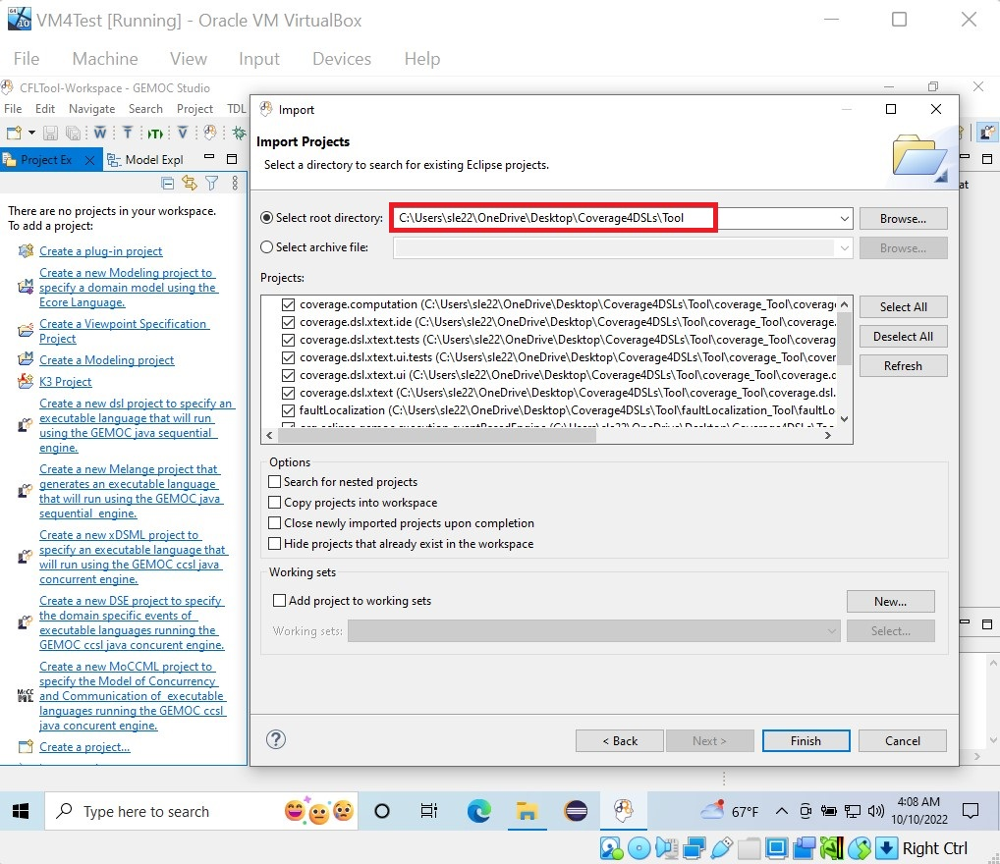

We created a virtual machine using [Oracle VM VirtualBox](https://www.virtualbox.org/) and set it up for easy use of the tool on the windows 10 OS.
You can access the virtual machine from [this Zenodo repository](https://zenodo.org/record/7261557).
Please note that the virtual machine has all the contents for running the tool of this repository (it is on the desktop in a folder named `Coverage4DSLs`).

# Setup
1. Run the Gemoc Studio using the icon pinned to the taskbar or by searching it.

    

2.	It asks for a workspace, either select an existing workspace or a new folder, then select `Launch`.

    

3.	An empty workspace will be shown. Import the projects from the `Coverage4DSLs\Tool` directory (which is on the desktop) using `Import projects` option shown in the `Project Explorer` or from `File` menu -> `Import` -> `Existing Projects into Workspace` -> `Select Root Directory` (browse to the **Coverage4DSLs\Tool** directory) -> `Select Folder` -> `Finish`.

    

# Usage
Please refer to the README file of the tool: https://github.com/Faezeh-Kh/Coverage4DSLs/blob/main/README.md#usage

